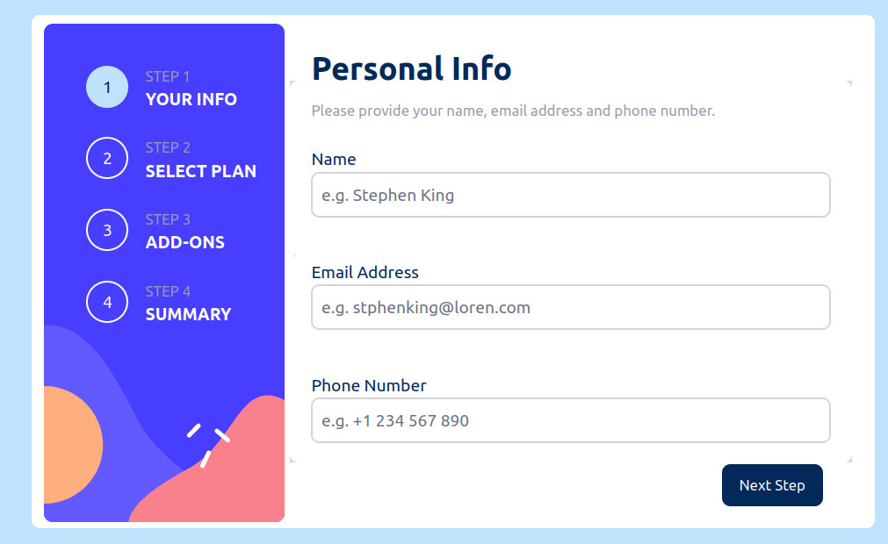

# Frontend Mentor - Multi-step form solution

This is a solution to the [Multi-step form challenge on Frontend Mentor](https://www.frontendmentor.io/challenges/multistep-form-YVAnSdqQBJ). Frontend Mentor challenges help you improve your coding skills by building realistic projects.

## Table of contents

- [Overview](#overview)
  - [The challenge](#the-challenge)
  - [Screenshot](#screenshot)
  - [Links](#links)
- [My process](#my-process)
  - [Built with](#built-with)
  - [What I learned](#what-i-learned)
  - [Continued development](#continued-development)
  - [Useful resources](#useful-resources)
- [Author](#author)
- [Acknowledgments](#acknowledgments)

**Note: Delete this note and update the table of contents based on what sections you keep.**

## Overview

### The challenge

Users should be able to:

- Complete each step of the sequence
- Go back to a previous step to update their selections
- See a summary of their selections on the final step and confirm their order
- View the optimal layout for the interface depending on their device's screen size
- See hover and focus states for all interactive elements on the page
- Receive form validation messages if:
  - A field has been missed
  - The email address is not formatted correctly
  - A step is submitted, but no selection has been made

### Screenshot



[](https://nodesource.com/products/nsolid)

### Links

- Solution URL: [Add solution URL here](https://your-solution-url.com)
- Live Site URL: [Add live site URL here](https://your-live-site-url.com)

## My process

### Built with

- [Flowbite](https://www.flowbite-react.com) CSS library
- [React](https://reactjs.org/) - JS library
- [Next.js](https://nextjs.org/) - React framework
- [Tailwind](https://tailwindcss.com/) - For styles

### What I learned

Exercised the conditional CSS classes:

```jsx
  <div
    key={index}
    className={`flex md:flex-row md:justify-between md:p-2  border-2 mb-3
    ${choices[index] ? "border-black" : "border-gray-200"}
    w-full rounded-lg text-sm md:text-base h-14 md:h-16`}
  >
```

### Continued development

Learn more about useForms and stat coding in Typescript.

### Useful resources

- [useForms](https://www.youtube.com/watch?v=EbFW3u44xiY) - Very good tutorial about useForms.

## Author

- Website - [Thomas Tschoepke Soares](https://www.linkedin.com/in/thomas-soares-6791781b/)
- Frontend Mentor - [@ttsoares](https://www.frontendmentor.io/profile/ttsoares)

## Acknowledgments

Several nice people helping students with Youtube videos...
